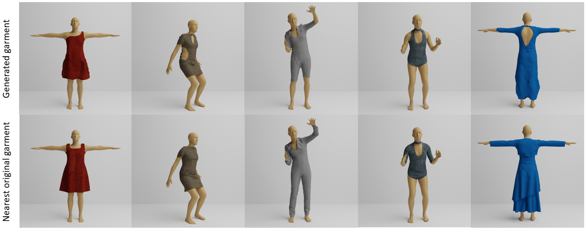
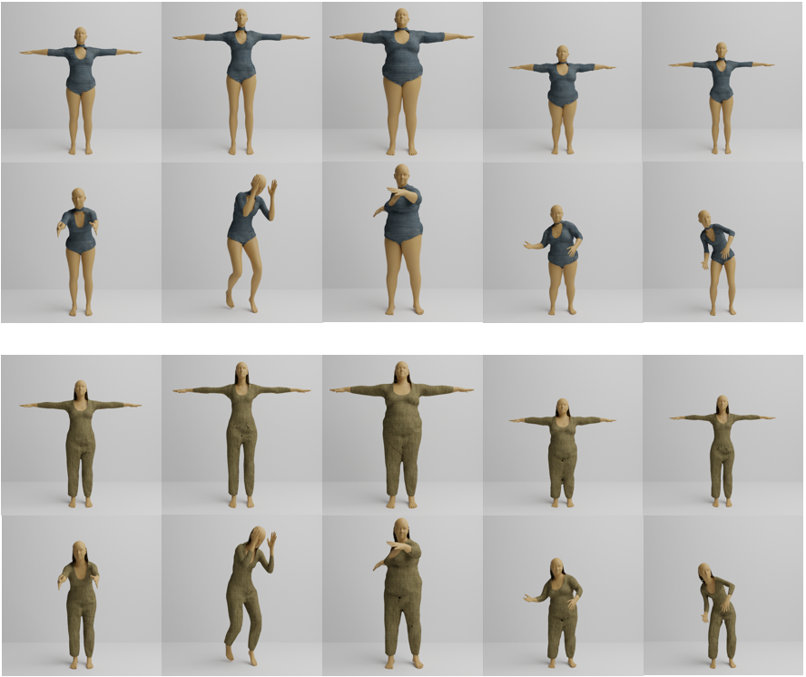

# GAN-based Garment Generation Using Sewing Pattern Images
### [Project](https://gamma.umd.edu/researchdirections/virtualtryon/garmentgeneration/) | [Video](http://cs.umd.edu/~yushen/videos/ECCV2020.mp4) | [Paper](http://cs.umd.edu/~yushen/docs/ECCV2020.pdf) <br>
We propose a garment generation model, which can support most gar-ment topologies and patterns, human body shapes and sizes, and garment materials. <br><br>
[GAN-based Garment Generation Using Sewing Pattern Images](https://gamma.umd.edu/researchdirections/virtualtryon/garmentgeneration/)  
[Yu Shen](http://cs.umd.edu/~yushen), [Junbang Liang](http://cs.umd.edu/~liangjb), [Ming C. Lin](http://cs.umd.edu/~lin).
 University of Maryland, College Park
 In ECCV 2020.  

- Our results
<p align='center'>
  
  
</p>

## Prerequisites
- Linux
- Python 2 or 3
- NVIDIA GPU (11G memory or larger) + CUDA cuDNN

## Getting Started
### Installation
TBD

### Dataset
- We publish a garment dataset [here](https://drive.google.com/drive/folders/1GR9cut1Ip7T3R-nYnuWPJUSarX8MT_xY?usp=sharing).

### Data preparation
TBD

### Training
TBD

### Testing
TBD


## Citation

If you find this useful for your research, please use the following.

```
@inproceedings{shen2020garmentgeneration,
  title={GAN-based Garment Generation Using Sewing Pattern Images},
  author={Yu Shen and Junbang Liang and Ming C. Lin},  
  booktitle={Proceedings of the European Conference on Computer Vision (ECCV)},
  year={2020}
}
```

## Acknowledgments
This code borrows heavily from [NVIDIA/pix2pixHD](https://github.com/NVIDIA/pix2pixHD).
